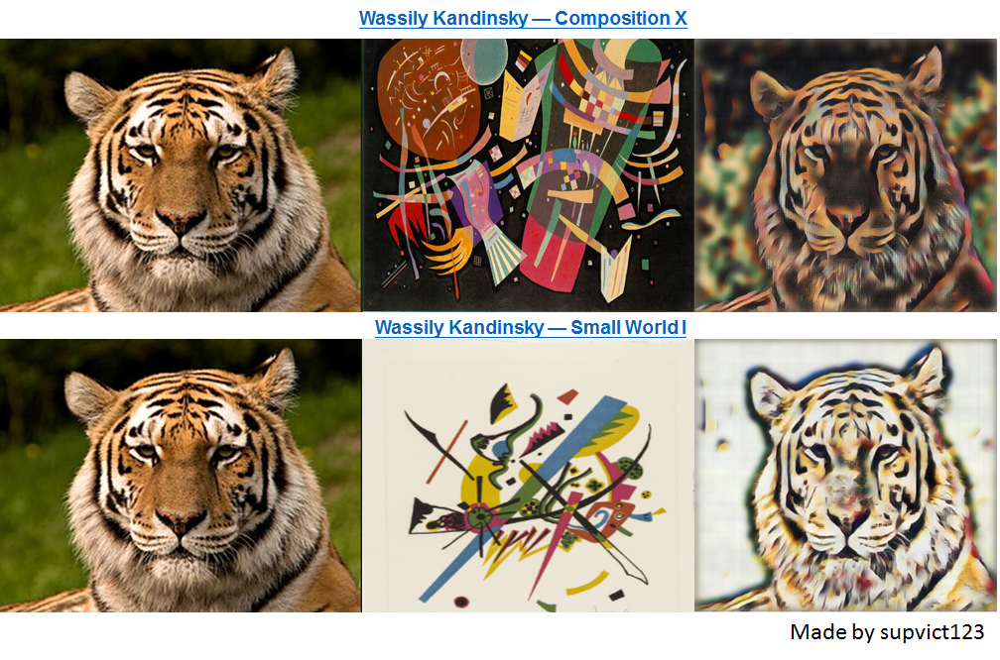

# style-swap
Demonstration of style swap for paper, Fast Patch-based Style Transfer of Arbitrary Style.
https://arxiv.org/pdf/1612.04337.pdf?fbclid=IwAR2xiW2dBBmnARfERb4wcC2wmLIUC9puHrdgLVCKDj5wZO3dqTCnYTfKl6w

Here I'm directly show you the result of this application.

Extract the style feature of two pictures and swap features between them.

Thus, the result shows in the right picture. 

That's really cool!
 

